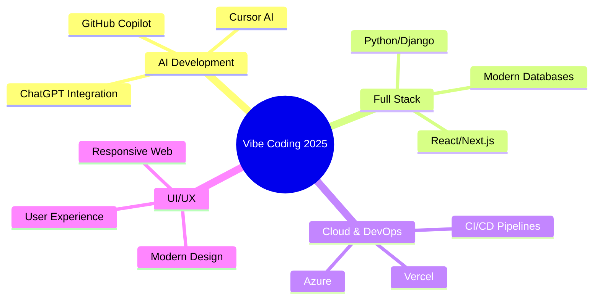

# 👋 Hello, I'm **Ravin Pandey**

<div align="center">

[](https://git.io/typing-svg)


</div>

---

## 🚀 **About Me**

```python
class RavinPandey:
    def __init__(self):
        self.name = "Ravinder Pandey"
        self.role = "Full Stack Python Developer"
        self.location = "India 🇮🇳"
        self.passion = "Vibe Coding & AI-Powered Development"
        self.motto = "The most important technology for developers in 2025 is the ability to learn new vibe coding technologies quickly."
        
    def get_current_focus(self):
        return [
            "🤖 AI-Assisted Development",
            "⚡ Rapid Prototyping",
            "🔥 Modern Web Technologies", 
            "🎯 Full Stack Excellence"
        ]
    
    def get_fun_fact(self):
        return "I believe in 'Vibe Coding' - where AI meets intuition! 🚀"
```

---

## 🛠️ **Tech Arsenal**

<div align="center">

### 🔥 **Core Languages & Frameworks**


### 🤖 **AI & Modern Development**


### 💾 **Databases & Cloud**


### 🎨 **Frontend & Styling**


### ⚙️ **Tools & Environment**


</div>

---

## 📊 **GitHub Analytics**

<div align="center">


</div>

<div align="center">


</div>

---

## 🏆 **GitHub Achievements**

<div align="center">


</div>

---

## 📈 **Contribution Graph**

<div align="center">


</div>

---

## 🎯 **Current Focus**

<div align="center">



</div>

---

## 🌐 **Connect With Me**

<div align="center">

[](https://sparkly-wisp-b300ce.netlify.app/)
[](https://www.linkedin.com/in/ravinder-pandey-56041b187/)
[](https://twitter.com/ravinpandey8)
[](https://instagram.com/ravinpandey08)
[](https://ravinpandey.hashnode.dev/)
[](https://leetcode.com/ravin08/)
[](mailto:pandeyravinder078@gmail.com)

</div>

---

## 🎨 **Featured Projects**

<div align="center">

| Project | Description | Tech Stack | Status |
|---------|-------------|------------|--------|
| 🚀 **AI-Powered Dashboard** | Modern analytics dashboard with AI insights | React, Python, FastAPI | 🔥 Active |
| 💻 **E-Commerce Platform** | Full-stack shopping platform | Django, React, PostgreSQL | ✅ Complete |
| 🤖 **Automation Bot** | Smart workflow automation tool | Python, n8n, APIs | 🚧 Development |
| 📱 **Mobile-First App** | Responsive web application | Next.js, TailwindCSS | 📋 Planning |

</div>

---

## 💡 **Fun Stats & Facts**

<div align="center">

<table>
<tr>
<td align="center">

<br><b>Lines of Code</b><br>♾️ Infinite
</td>
<td align="center">

<br><b>Coffee Consumed</b><br>☕ Too Many
</td>
<td align="center">

<br><b>Bugs Fixed</b><br>🐛 Countless
</td>
</tr>
</table>

</div>

---

## 📱 **Developer Card**

<div align="center">

<a href="https://app.daily.dev/ravinder65">
  
</a>

</div>

---

## 🎵 **Currently Vibing To**

<div align="center">

[](https://spotify-github-profile.vercel.app/api/spotify-playing)

*"Good code is like good music - it has rhythm, structure, and makes you feel something."* 🎶

</div>

---

## ⚡ **Quick Facts**

<div align="center">

```yaml
Name: Ravinder Pandey
Located_in: India
Current_work: Full Stack Development
Education: Always Learning
Hobbies: 
  - Coding
  - Exploring AI Tools
  - Tech Blogging
  - Open Source Contributing
```

</div>

---

## 🌟 **Quote of the Day**

<div align="center">

[](https://github.com/piyushsuthar/github-readme-quotes)

</div>

---

## 💰 **Support My Work**

<div align="center">

If you like what I do, maybe consider buying me a coffee? ☕

[](https://www.buymeacoffee.com/pandeyravin)

</div>

---

## 🐍 **Contribution Snake**

<div align="center">


</div>

---

<div align="center">

### ✨ *"Building the future, one commit at a time"* ✨


**⭐ Star this repository if you found it interesting!**

---


</div>
