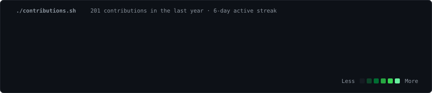

  <h3><code>ravin@github ~ $ ./contributions.sh</code></h3>
  

    

  <h3><code>ravin@github ~ $ whoami</code></h3>
  <table>
    <tr>
      <td valign="top" width="370">
        
      </td>
      <td valign="top" width="490">
        
      </td>
    </tr>
  </table>

   

  

    <a href="https://voxly-oss.vercel.app"><b>Project Voxly</b></a> •
    <a href="https://ravinpandey.hashnode.dev/"><b>Blog</b></a> •
    <a href="https://linkedin.com/in/ravinder-pandey-56041b187"><b>LinkedIn</b></a>
  

